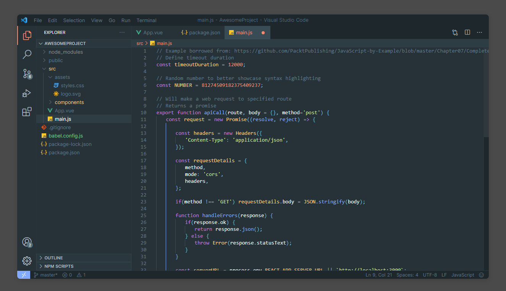

# Material Theme Oceanic custom for VS Code

    </img>

\
&nbsp;

## It looks like this
---
\
&nbsp;

\
&nbsp;
\
&nbsp;

## Description
---
\
&nbsp;
This is a port of the famous [Material Theme](https://github.com/equinusocio/vsc-material-theme) for Vs Code, allowing a total customization of the IDE including Themes, Color Schemes, Icons and many other features.
\
&nbsp;
\
&nbsp;
## Install
---
\
&nbsp;
[How to install Visual Studio Code extensions](https://code.visualstudio.com/docs/editor/extension-marketplace)
\
&nbsp;
\
&nbsp;
[Direct link to Visual Studio Code Marketplace](https://marketplace.visualstudio.com/items?itemName=berthomejulien.material-theme-oceanic-custom)
\
&nbsp;
\
&nbsp;
## License
---
\
&nbsp;
Licensed under MIT

